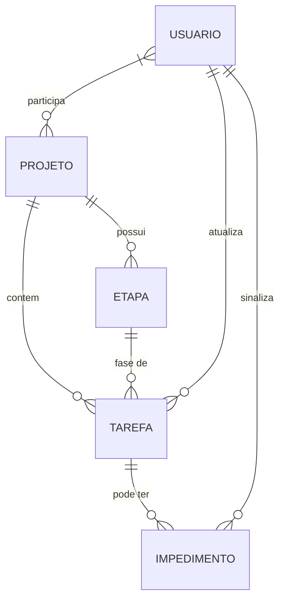

# REASONS Canvas — kanban-configuravel
_Status: DRAFT | Idioma: pt_BR | Iniciado em: 2026-08-26_

> **Como usar:** cada skill do pipeline preenche suas dimensões ao concluir.
> Canvas transita de DRAFT → READY quando todas as 7 dimensões estiverem preenchidas.
> READY = canvas executável por outro agente de implementação.

---

## R — Requirements

_Atualizado por: /discovery v1.0 — 2026-08-26_
> Decisões: —

**Objetivos de negócio:**
1. Reduzir tempo de execução e de impedimento das atividades — métrica qualitativa, sem meta numérica definida
2. Eliminar comunicação dispersa sobre status/impedimentos — métrica qualitativa, sem meta numérica definida
3. Dar visibilidade de andamento e lead-time aos gestores — métrica qualitativa, sem meta numérica definida

**Critério de sucesso qualitativo:** impedimentos identificados e resolvidos rapidamente sem cruzamento manual de reports; gestores conseguindo visualizar andamento e lead-time diretamente no sistema.

**Escopo IN:**
- Kanban board com etapas configuráveis por projeto
- Atualização de status e impedimentos em tempo real pelos próprios desenvolvedores
- Notificações automáticas de impedimento
- Lead-time visível por etapa no board da tarefa
- Dashboard agregado com lead-time
- Suporte a edição simultânea por múltiplos usuários na mesma tarefa

**Escopo OUT:**
- Integração com sistemas externos de notificação (email, Slack etc.)
- Controle de horas/timesheet do desenvolvedor
- Suporte a múltiplas organizações/clientes

---

## E — Entities

_Atualizado por: /discovery v1.0 — 2026-08-26_
> Decisões: —

**Entidades principais:**
- **Projeto**: Agregador de tarefas com configuração própria de etapas (workflow customizável)
- **Etapa**: Coluna do kanban, configurável por projeto (ex.: Backlog, Em Progresso, Em Revisão, Concluído)
- **Tarefa**: Item de trabalho que percorre as etapas, possui status, responsável, lead-time por etapa
- **Impedimento**: Bloqueio sinalizado pelo dev em uma tarefa, com notificação automática e timestamp de abertura/resolução
- **Usuário**: Desenvolvedor ou gestor; executa ações (atualiza status, sinaliza impedimento) ou apenas visualiza (gestores)

---

## A — Approach

_Atualizado por: /techspec v1.0 — {{DATE}}_
> Decisões: —

**Estratégia de solução:**
{{ESTRATEGIA_DE_SOLUCAO}}

**Trade-offs aceitos:**
- {{TRADEOFF_1}}

---

## S — Structure

_Atualizado por: /techspec v1.0 — {{DATE}}_
> Decisões: —

**Arquitetura:**
{{ARQUITETURA}}

**Dependências externas:**
- {{DEPENDENCIA_1}}

---

## O — Operations

_Atualizado por: /tasks v1.0 — {{DATE}}_
> Decisões: —

**Tasks ordenadas por dependência:**
- [ ] TASK-01.1 — {{DESCRICAO_TASK}}
- [ ] TASK-01.2 — {{DESCRICAO_TASK}}

---

## N — Norms

_Atualizado por: /guidelines v1.0 — {{DATE}}_
> Decisões: —

**Padrões relevantes para esta feature:**
- {{PADRAO_1}}
- {{PADRAO_2}}

---

## S — Safeguards

_Atualizado por: /code-review v1.0 — {{DATE}}_
> Decisões: —

**Restrições:**
- {{RESTRICAO_1}}

**O que NÃO fazer:**
- {{NAO_FAZER_1}}