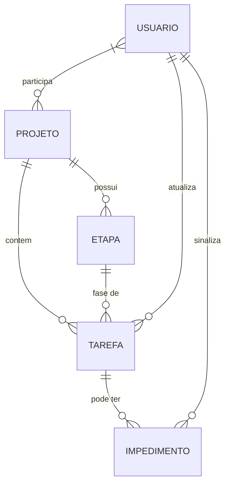

# REASONS Canvas — kanban-configuravel
_Status: DRAFT | Idioma: pt_BR | Iniciado em: 2026-08-26_

> **Como usar:** cada skill do pipeline preenche suas dimensões ao concluir.
> Canvas transita de DRAFT → READY quando todas as 7 dimensões estiverem preenchidas.
> READY = canvas executável por outro agente de implementação.

---

## R — Requirements

_Atualizado por: /prd v1.0 — 2026-08-27_
> Decisões: BDR-001 (priorização Must Have para todos RFs), BDR-002 (N_VARIACOES=5 cenários Gherkin por RF)

**Objetivos de negócio:**
1. Reduzir tempo de execução e de impedimento das atividades — métrica qualitativa, sem meta numérica definida
2. Eliminar comunicação dispersa sobre status/impedimentos — métrica qualitativa, sem meta numérica definida
3. Dar visibilidade de andamento e lead-time aos gestores — métrica qualitativa, sem meta numérica definida

**Critério de sucesso qualitativo:** impedimentos identificados e resolvidos rapidamente sem cruzamento manual de reports; gestores conseguindo visualizar andamento e lead-time diretamente no sistema.

**RFs Must Have:**
- RF-001: Board com colunas configuráveis por projeto
- RF-002: Workflows com transições configuráveis entre etapas (n para n)
- RF-003: CRUD de tarefas
- RF-004: Sinalização de impedimento
- RF-005: Notificação de transições aos observadores
- RF-006: Cálculo de lead-time por etapa e lead-time de impedimento
- RF-007: Dashboard de gestão com lead-time médio, por etapa, impedido
- RF-008: CRUD de projetos
- RF-009: CRUD de workflows por projeto
- RF-010: CRUD de colunas (etapas) no board
- RF-011: CRUD de raias (swimlanes) no board
- RF-012: Etapa final com opção de reabertura
- RF-013: Controle de acesso por papéis configuráveis, escopados por projeto
- RF-014: Associação de usuário a projeto(s) com papel(is)
- RF-015: Configuração de permissões por projeto (toggles)
- RF-016: Histórico de auditoria da tarefa
- RF-017: Criar card pelo board
- RF-018: Excluir card pelo board

**RNFs:**
- RNF-001: Atualização em tempo real (≤ 2s propagação)
- RNF-002: Escalabilidade horizontal sem inconsistência (multi-pod)
- RNF-003: Autenticação/autorização (Keycloak + fallback local, validação backend)
- RNF-004: Auditoria e rastreabilidade (append-only)
- RNF-005: Integridade de fluxo de negócio (projeto finalizado bloqueia escrita)

**Regras de negócio (17 regras):** RN-001 a RN-017 cobrindo movimentação, impedimento, lead-time, edição, atribuição, finalização, projeto, toggles, raias, papéis, criação/exclusão de card.

**Escopo IN:**
- Kanban board com etapas configuráveis por projeto
- Atualização de status e impedimentos em tempo real pelos próprios desenvolvedores
- Notificações automáticas de impedimento
- Lead-time visível por etapa no board da tarefa
- Dashboard agregado com lead-time
- Suporte a edição simultânea por múltiplos usuários na mesma tarefa
- CRUD de projetos, workflows, etapas, raias
- Controle de acesso por papéis configuráveis por projeto
- Toggles de permissão por projeto
- Histórico de auditoria append-only
- Criação/exclusão de card direto no board com confirmação

**Escopo OUT:**
- Integração com sistemas externos de notificação (email, Slack etc.)
- Controle de horas/timesheet do desenvolvedor
- Suporte a múltiplas organizações/clientes
- Cache ou message broker externo (Redis, RabbitMQ, Kafka)
- Compliance regulatório formal (LGPD, SOC2, etc.)
- Restringir inscrição no canal de tempo real apenas a membros do projeto (débito conhecido)
- Chaveamento automático para login local ao detectar indisponibilidade do Keycloak
- Métricas avançadas de dashboard além de lead-time médio e tempo médio em impedimento por etapa
- Medição automatizada de cobertura de teste (ferramenta no pipeline)
- Edição de campos do card além do necessário para criação
- Tela de administração/configuração de projeto no módulo criação-card-board
- Escolha manual de etapa ou raia na criação de card
- Recuperação/restauração de card excluído pela interface (lixeira/desfazer)

---

## E — Entities

_Atualizado por: /discovery v1.0 — 2026-08-26_
> Decisões: —
_Atualizado por: /designer v1.0 — 2026-08-27_
> Decisões: DDR-001, DDR-002, DDR-003, DDR-004, DDR-005, DDR-006, DDR-007, DDR-008, DDR-009

**Entidades principais (domínio):**
- **Projeto**: Agregador de tarefas com configuração própria de etapas (workflow customizável)
- **Etapa**: Coluna do kanban, configurável por projeto (ex.: Backlog, Em Progresso, Em Revisão, Concluído)
- **Tarefa**: Item de trabalho que percorre as etapas, possui status, responsável, lead-time por etapa
- **Impedimento**: Bloqueio sinalizado pelo dev em uma tarefa, com notificação automática e timestamp de abertura/resolução
- **Usuário**: Desenvolvedor ou gestor; executa ações (atualiza status, sinaliza impedimento) ou apenas visualiza (gestores)

**Entidades de UX/UI (telas, componentes, tokens):**
- **S01 Board**: Tela principal — grid de colunas (Etapa), cards (Tarefa), raias (Swimlane), drag-drop com destaque de destino válido, menu alternativo de movimentação, badge de impedimento, botão "Novo card", ícone exclusão no card, seletor de projeto, topbar
- **S02 Dashboard**: Tela de gestão — gráfico de barras (lead-time médio por etapa), tabela de métricas, seletor de período, skeleton loading para job assíncrono
- **S03 Admin**: Painel de administração — abas (Projetos, Workflows, Colunas, Raias, Membros, Toggles, Papéis), topbar com seletor de projeto
- **S04 Detalhe Tarefa**: Tempo por etapa, impedimentos, observadores, atribuição/autoatribuição, edição título/descrição/tipo, histórico auditoria (RF-017)
- **S05 Modal Criar Card**: Título (obrigatório), descrição, tipo; etapa/raia iniciais automáticas; estados idle/validação/salvando/sucesso
- **S06 Modal Confirmar Exclusão**: Confirmação destrutiva com loading; tratamento idempotente de card já removido
- **S07 Modal Finalizar/Desfinalizar**: Escolha de etapa de destino; permissão product_owner/project_admin/admin global
- **S08 Config Workflow/Colunas/Transições**: CRUD de workflow, etapas, transições n-para-n; validação de integridade (etapa não-final sem saída)
- **S09 Gestão Membros/Toggles/Papéis**: Associação usuário-projeto-papel, toggles de permissão por projeto, gestão de papéis globais (apenas admin global)

**Design System (tokens):**
- **Cores (10 canônicos + 1 opcional):** primary #0d6efd, success #198754, error #dc3545, warning #ffc107, surface #ffffff, background #f8f9fa, text-primary #212529, text-secondary #6c757d, border #dee2e6, tipo-badge-bg #e7f1ff, disabled #adb5bd (opcional)
- **Tipografia:** Roboto (heading/body), Roboto Mono (mono); escala xs12/base14/h2-20/h1-28/code13; pesos h1=700/h2=500/body=400
- **Espaçamento:** base 8px (meio-passo 4px) — xs4/sm8/md16/lg24/xl32
- **Raios:** sm4/md6/lg8/pill50%
- **Breakpoint:** desktop-only ≥ 1024px

**Navegação:** Topbar plana com seletor de projeto global (contexto implícito persistido), rotas `/`, `/dashboard`, `/tarefas/:id`, `/admin`

**Acessibilidade:** WCAG AA não obrigatório; teclado nativo apenas; alternativa a drag-drop = menu no card; ARIA default dos componentes

**Decisões de layout abertas (12 variações no protótipo):** densidade card (S01), raias expansíveis (S01), ícone exclusão hover (S01), navegação admin abas/lateral (S03), dashboard empilhado/lado-a-lado (S02), modal criar card essencial/completo (S05)

---

## A — Approach

_Atualizado por: /techspec v1.0 — {{DATE}}_
> Decisões: —

**Estratégia de solução:**
{{ESTRATEGIA_DE_SOLUCAO}}

**Trade-offs aceitos:**
- {{TRADEOFF_1}}

---

## S — Structure

_Atualizado por: /techspec v1.0 — {{DATE}}_
> Decisões: —

**Arquitetura:**
{{ARQUITETURA}}

**Dependências externas:**
- {{DEPENDENCIA_1}}

---

## O — Operations

_Atualizado por: /tasks v1.0 — {{DATE}}_
> Decisões: —

**Tasks ordenadas por dependência:**
- [ ] TASK-01.1 — {{DESCRICAO_TASK}}
- [ ] TASK-01.2 — {{DESCRICAO_TASK}}

---

## N — Norms

_Atualizado por: /guidelines v1.0 — {{DATE}}_
> Decisões: —

**Padrões relevantes para esta feature:**
- {{PADRAO_1}}
- {{PADRAO_2}}

---

## S — Safeguards

_Atualizado por: /code-review v1.0 — {{DATE}}_
> Decisões: —

**Restrições:**
- {{RESTRICAO_1}}

**O que NÃO fazer:**
- {{NAO_FAZER_1}}