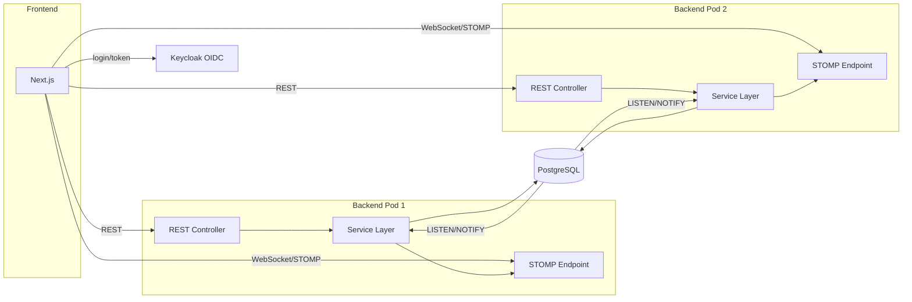

# TechSpec — Kanban Configurável
_Versão: 1.3 | Status: Draft | Data: 2026-08-23 | Autor: Thiago Goncalves Cavalcante_
_PRD: docs/prd/kanban-configuravel-prd.md v1.3_

---

## 1. Visão Geral Técnica

Sistema web para gestão de atividades em board kanban com workflows e etapas configuráveis por projeto. Backend Spring Boot (Java 25) expõe API REST + WebSocket/STOMP para atualização em tempo real; frontend Next.js consome ambos. Autenticação via Keycloak (OIDC), com RBAC híbrido (papéis/permissões modelados na aplicação). Persistência em PostgreSQL, sem cache/broker dedicado nesta fase — broadcast entre pods via `LISTEN/NOTIFY`, e cálculo do dashboard assíncrono para evitar timeout.

**Sistemas afetados:** CRUDAO (único sistema; integração externa apenas com Keycloak).

**Abordagem:** REST + WebSocket/STOMP (event-driven para atualizações), processamento assíncrono para agregações pesadas (dashboard).

---

## 2. Decisões Arquiteturais

> Decisões: ADR-001, ADR-002, ADR-003, ADR-004, ADR-005, ADR-006, BDR-001

| ADR | Decisão | Impacto |
|-----|---------|---------|
| ADR-001 | Stack backend Java 25 + Spring Boot LTS, WebSocket/STOMP, OIDC client | Define linguagem, framework e mecanismo de tempo real |
| ADR-002 | PostgreSQL único armazenamento, sem cache/broker nesta fase | Simplicidade inicial; risco de escala registrado |
| ADR-003 | RBAC híbrido: Keycloak autentica, aplicação modela papéis/permissões | Necessário para RF-013 (papéis configuráveis em runtime) |
| ADR-004 | Broadcast entre pods via PostgreSQL LISTEN/NOTIFY | Resolve consistência multi-pod sem broker dedicado (RNF-002) |
| ADR-005 | Dashboard calculado de forma assíncrona (`@Async` + entrega via WebSocket) | Evita timeout HTTP em agregações sobre período longo (RF-007) |
| ADR-006 | RBAC por projeto: checagem explícita via `AutorizacaoProjetoService` no Service (não mais só `@ExigePermissao`/AOP genérico) | Necessário para RF-013/RF-015 (BDR-001) — permissão escopada por projeto, sem resolução de `projetoId` mágica via reflection |
| BDR-001 | `admin` global vs. papéis por projeto acumuláveis (`UsuarioProjetoPapel`) | Redesenha o modelo de RBAC da TASK-04.1; base para RF-013, RF-015, RF-016, RF-017 |

---

## 3. Modelo de Dados

→ Documento completo: [data-model.md](kanban-configuravel/data-model.md)

**Entidades principais:**

| Entidade | Atributos-chave | Relacionamentos |
|----------|----------------|----------------|
| Projeto | nome, workflow_ativo_id | 1:N Workflow, 1:N Tarefa, 1:N Raia (opcional) |
| Workflow | projeto_id, versao | 1:N Etapa; 1:N Tarefa (via herança do projeto) |
| Etapa | workflow_id, ordem, e_final | 1:N Transição (origem/destino), 1:N Tarefa |
| Transição | etapa_origem_id, etapa_destino_id, tipo | N:1 Etapa (origem e destino) |
| Raia | projeto_id (nullable), ordem | N:1 Projeto (opcional); 1:N Tarefa |
| Tarefa | projeto_id, workflow_id, etapa_atual_id, impedida, tipo | N:1 Projeto/Workflow/Etapa/Raia, 1:N RegistroEtapa, 1:N Impedimento, 1:N Observador, 1:N AuditoriaTarefa |
| RegistroEtapa | tarefa_id, etapa_id, entrada_em, saida_em, tempo_impedimento_segundos | N:1 Tarefa, N:1 Etapa |
| Impedimento | tarefa_id, registro_etapa_id, inicio_em, fim_em | N:1 Tarefa, N:1 RegistroEtapa |
| Observador | tarefa_id, usuario_id | N:1 Tarefa, N:1 Usuário |
| Usuário | keycloak_sub, admin (bool) | 1:N UsuarioProjetoPapel |
| Papel | nome, protegido | 1:N PapelPermissao, 1:N UsuarioProjetoPapel |
| Permissão | chave | 1:N PapelPermissao |
| **UsuarioProjetoPapel** _(novo, v1.1)_ | usuario_id, projeto_id, papel_id | N:1 Usuário/Projeto/Papel — chave composta, múltiplos papéis por (usuário, projeto) |
| **ConfiguracaoProjeto** _(novo, v1.1)_ | projeto_id, 3 toggles booleanos | 1:1 Projeto |
| **AuditoriaTarefa** _(novo, v1.1)_ | tarefa_id, usuario_id, campo, valor_anterior, valor_novo | N:1 Tarefa, N:1 Usuário |

Projeto ganha `data_finalizacao` (nullable) — ver [data-model.md](kanban-configuravel/data-model.md) para detalhes completos das novas entidades (RF-013, RF-015, RF-016, RF-017, BDR-001).

---

## 4. Contratos de API / Interface

### Board — REST

**Tipo:** REST

**Contrato:**
- Entrada: `GET /api/projetos/{id}/board` (query: nenhum obrigatório)
- Saída: colunas (etapas), raias, tarefas posicionadas, transições permitidas por etapa atual
- Erros: 403 (sem permissão de visualizar o projeto), 404 (projeto não encontrado)

### Mover tarefa — REST

**Tipo:** REST

**Contrato:**
- Entrada: `PATCH /api/tarefas/{id}/mover` `{ etapaDestinoId }`
- Saída: tarefa atualizada com nova etapa e novo RegistroEtapa aberto
- Erros: 409 (transição não permitida pelo workflow), 403 (sem permissão)

### Marcar/desmarcar impedimento — REST

**Tipo:** REST

**Contrato:**
- Entrada: `POST /api/tarefas/{id}/impedimento` `{ motivo? }` | `DELETE /api/tarefas/{id}/impedimento`
- Saída: tarefa com `impedida=true/false`, impedimento aberto/fechado
- Erros: 403, 404

### Eventos em tempo real — WebSocket/STOMP

**Tipo:** Event

**Contrato:**
- Canal: `/topic/projetos/{id}/board`
- Payload: `{ tipo: "TAREFA_MOVIDA" | "IMPEDIMENTO_ALTERADO" | "TAREFA_CRIADA" | ..., tarefaId, ... }`
- Entrega: em até 2s após o evento de origem (RNF-001)

### Dashboard assíncrono — REST + Event

**Tipo:** REST (disparo) + Event (entrega)

**Contrato:**
- Entrada: `POST /api/projetos/{id}/dashboard/calcular` `{ dataInicio, dataFim }`
- Saída imediata: `{ jobId }` (202 Accepted)
- Entrega do resultado: evento STOMP `/topic/projetos/{id}/dashboard/{jobId}` com `{ leadTimeMedioPorEtapa, tempoMedioImpedimento }`
- Fallback: `GET /api/projetos/{id}/dashboard/jobs/{jobId}` para polling se WebSocket indisponível

### Autenticação — OIDC (Keycloak)

→ Contrato mock: [CRUDAO-keycloak-mock-contract.md](../contracts/CRUDAO-keycloak-mock-contract.md) — **PENDENTE DE VALIDAÇÃO**, sem instância real disponível ainda. Nota: validado de fato via instância real na TASK-00.1 — mock permanece só como fallback documental.

### Permissões do usuário atual — REST _(novo, v1.1)_

**Tipo:** REST

**Contrato:**
- Entrada: `GET /api/usuarios/me`
- Saída: `{ id, nome, admin: boolean, projetos: [{ projetoId, papeis: [nome...], permissoes: [chave...] }] }` — usado pelo frontend só para decidir o que exibir/habilitar (nunca é a fonte de autorização — RNF-003, ADR-006)
- Erros: 401 (não autenticado)
- **Estratégia de carga (achado do comitê — database):** resolver `UsuarioProjetoPapel → Papel → PapelPermissao → Permissao` do usuário em uma única query agregada (`JOIN FETCH` ou equivalente), não N idas ao banco por papel — risco de N+1 se implementado ingenuamente.

### Associação usuário↔projeto↔papel — REST _(novo, v1.1, RF-015)_

**Tipo:** REST

**Contrato:**
- `GET /api/projetos/{projetoId}/membros` — lista usuários associados e seus papéis naquele projeto. **Erros (revisão v1.2 — achado do comitê, security):** 403 se o usuário não tem nenhum vínculo com o projeto (nem `admin`, nem qualquer papel via `UsuarioProjetoPapel` naquele `projetoId`) — antes deixado implícito, agora explícito para não repetir o padrão observado em outros endpoints do projeto sem controle de acesso (nota histórica em `memory/state.md`, TASK-02.1).
- `PUT /api/projetos/{projetoId}/membros/{usuarioId}` `{ papeis: [papelId...] }` — define o conjunto de papéis do usuário naquele projeto (substitui todos de uma vez); `papeis: []` remove a associação
- Erros: 403 (sem `projeto:gerenciar` naquele projeto), 404, 422 (papel inexistente, **ou papel cuja permissão inclui `papel:gerenciar` — sempre rejeitado aqui, RN-006/RN-008 — inclui o papel `admin`**)

### CRUD de Papel/Permissão — REST _(contrato explicitado, v1.2, RF-013 — achado do comitê, security)_

**Tipo:** REST

**Contrato:**
- `GET /api/papeis`, `POST /api/papeis` `{ nome, permissoes: [chave...] }`, `PUT /api/papeis/{id}` `{ nome, permissoes }`, `DELETE /api/papeis/{id}` — endpoints já existentes desde a TASK-04.1, contrato agora explicitado nesta revisão
- Regra: todos exigem `@ExigePermissao("papel:gerenciar")`; pós-refatoração do ADR-006, `PermissaoAspect` checa essa chave especificamente **contra `Usuario.admin`, nunca contra `UsuarioProjetoPapel`** — `papel:gerenciar` não é uma permissão atribuível a nenhum papel de projeto (fecha o vetor "project_admin manipula permissões de um papel existente para escalar privilégio")
- `PUT`/`DELETE` no papel `admin` (`protegido=true`) continuam bloqueados (RN-006)
- Erros: 403 (sem `Usuario.admin=true`), 404, 409 (tentativa de alterar/excluir papel protegido)

### Configuração de projeto (toggles) — REST _(novo, v1.1, RF-016)_

**Tipo:** REST

**Contrato:**
- `GET /api/projetos/{id}/configuracao`
- `PUT /api/projetos/{id}/configuracao` `{ devPodeExcluirTarefa, devPodeEditarTarefaIniciada, gestorVeBoard }`
- Erros: 403 (sem `projeto:gerenciar` naquele projeto), 404, 409 (projeto finalizado)

### Finalizar/reabrir projeto — REST _(novo, v1.1, RF-008, RN-015)_

**Tipo:** REST

**Contrato:**
- `PUT /api/projetos/{id}/finalizar` — preenche `data_finalizacao`
- `DELETE /api/projetos/{id}/finalizar` — limpa `data_finalizacao` (reabre)
- Erros: 403 (sem `projeto:gerenciar`), 404

### Histórico de auditoria da tarefa — REST _(novo, v1.1, RF-017)_

**Tipo:** REST

**Contrato:**
- Entrada: `GET /api/tarefas/{id}/historico`
- Saída: lista de `{ campo, valorAnterior, valorNovo, usuarioId, usuarioNome, criadoEm }`, ordenada por `criadoEm` desc
- Erros: 403 (sem acesso ao projeto da tarefa), 404

### Mover tarefa entre projetos — REST _(contrato explicitado, v1.2, RF-003 — achado do /analyze, findings G1/G2)_

**Tipo:** REST

**Contrato:**
- Entrada: `PATCH /api/tarefas/{id}/mover-projeto` `{ projetoDestinoId, workflowDestinoId, etapaDestinoId }` (endpoint já existente desde a TASK-02.1)
- Regra: exige `tarefa:gerenciar` **no projeto de origem E no projeto de destino** — duas chamadas a `AutorizacaoProjetoService.exigirPermissao`, uma por projeto. Documentado desde `data-model.md` v1.0 ("tarefa pode ser movida entre projetos por um admin com permissão em ambos os projetos"), não propagado à TechSpec até esta revisão
- Erros: 403 (falta permissão em qualquer um dos dois projetos), 404, 409 (projeto de origem ou destino finalizado, RN-015)

### Atribuir/autoatribuir tarefa — REST _(revisão, v1.1, RF-003, RN-012)_

**Tipo:** REST

**Contrato:**
- Entrada: `PATCH /api/tarefas/{id}/responsavel` `{ usuarioId }`
- Saída: tarefa com `responsavelId` atualizado
- Regra: se `usuarioId` != usuário autenticado, exige permissão `tarefa:atribuir` (product_owner/project_admin/admin); se `usuarioId` == usuário autenticado ("puxar"), qualquer membro do projeto pode, mesmo já atribuída a outro
- Efeito colateral: grava `AuditoriaTarefa` (campo `RESPONSAVEL`)
- Erros: 403, 404

---

## 5. Arquitetura e Fluxo

**Fluxo principal (mover tarefa):**
1. Frontend envia `PATCH /api/tarefas/{id}/mover` ao pod que o atende.
2. Service valida transição contra o workflow (RN-003), grava novo `RegistroEtapa` e fecha o anterior no PostgreSQL.
3. Service dispara `NOTIFY` no canal do projeto com o evento.
4. Todos os pods inscritos (`LISTEN`) recebem a notificação e retransmitem via STOMP aos clientes conectados localmente, incluindo observadores da tarefa (RF-005).
5. Frontend atualiza o board em até 2s (RNF-001).

---

## 6. Dependências Inter-Sistemas

| Sistema | Interface | Status | Mock? |
|---------|-----------|--------|-------|
| Keycloak | Autenticação OIDC | ok — validado na TASK-00.1 | Não — [CRUDAO-keycloak-contract.md](../contracts/CRUDAO-keycloak-contract.md) |

**Task de substituição:** concluída — TASK-00.1 provisionou Keycloak via Docker, configurou realm/client do CRUDAO e validou as claims (2026-08-22).

---

## 7. Estratégia de Testes

| Tipo | Ferramenta | Cobertura alvo |
|------|-----------|----------------|
| Unitário (regras de negócio) | JUnit 5 | 80% (TDD) / 100% para cenários Gherkin do PRD (BDD) |
| Integração (API + PostgreSQL) | JUnit 5 + Testcontainers | Fluxos críticos: transições de workflow, cálculo de lead-time, RBAC |
| Frontend (componentes) | Jest/Vitest + Testing Library | 80% (TDD) / 100% para cenários Gherkin do PRD (BDD) |
| E2E | A definir em `/tasks` (ex.: Playwright) | Fluxos principais: mover card, marcar impedimento, dashboard |

Cenários prioritários de teste: engine de transições de workflow (permitido/proibido), cálculo de lead-time com períodos de impedimento intercalados, RBAC (papel admin protegido — RN-006), broadcast multi-pod (LISTEN/NOTIFY).

**Cenários adicionais (v1.1, BDR-001/ADR-006):**
- `AutorizacaoProjetoService`: admin global autorizado em qualquer projeto; usuário com papel só no Projeto A recebe 403 ao tentar agir no Projeto B; usuário com 2 papéis no mesmo projeto acumula permissões de ambos.
- Transição para/de etapa final exige `tarefa:finalizar` — dev sem a permissão recebe 403 (RN-011).
- Edição de tarefa "iniciada" por dev sem o toggle `devPodeEditarTarefaIniciada` — 403; com o toggle ligado — permitido.
- Autoatribuição ("puxar") de tarefa já atribuída a outro dev — permitido sem aprovação; tentativa de dev atribuir a um terceiro — 403 (RN-012); ambos os fluxos gravam `AuditoriaTarefa`.
- Projeto finalizado: toda escrita (tarefa, workflow, etapa, raia, membro) retorna 409/403, inclusive para admin/project_admin (RN-015).

---

## 8. Segurança e Observabilidade

**Segurança:**
- Toda rota de escrita valida permissão do usuário autenticado via papel/permissão (RNF-003).
- Papel `admin` protegido contra alteração por papéis delegados (RN-006), validado no Service, não apenas na UI.
- Fallback de autenticação própria caso Keycloak esteja indisponível (RF-014 Should Have) — detalhar mecanismo na implementação.
- Boas práticas OWASP Top 10 como baseline (validação de entrada via Bean Validation, prepared statements via JPA).
- **(v1.1, ADR-006)** Toda checagem de permissão escopada a projeto usa `projetoId` resolvido no backend (da entidade carregada, nunca do payload do cliente) — nenhuma ação de escrita depende de dado enviado pelo cliente para decidir autorização (RNF-003 reforçada). Gating no frontend (esconder botão, desabilitar campo com base em `GET /api/usuarios/me`) é puramente de UX — o backend revalida sempre, de forma independente.
- **(v1.1)** `project_admin` nunca consegue conceder o papel `admin` via `PUT /api/projetos/{id}/membros/{usuarioId}` — a API rejeita explicitamente `admin` nesse endpoint (só existe via `Usuario.admin`, editável apenas pelo admin global). **(v1.2)** Também rejeita qualquer papel cuja permissão inclua `papel:gerenciar` — essa chave nunca é atribuível via `UsuarioProjetoPapel`, só via `Usuario.admin` (achado do comitê — security, RN-006 superseded em parte, PRD v1.3).
- **(v1.2) Estratégia de enforcement (achado convergente do comitê — security + architect):** `AutorizacaoProjetoService.exigirPermissao` é o único ponto que decide autorização escopada a projeto — chamado explicitamente por cada Service, substituindo o AOP genérico só para ações escopadas (ADR-006). Como isso troca uma garantia "por construção" por disciplina de chamada explícita, a suíte de testes ganha um teste estrutural no CI (grep/reflection sobre `@Service` de domínio) que falha o build se um método de escrita não contiver a chamada — não é análise estática perfeita, mas move o risco de "esquecimento silencioso pego só em code review" para "falha visível de build".

**Observabilidade:**
- Logs: arquivo local com rotação a cada 5MB, retendo os 10 mais recentes (conforme guidelines/observability.md).
- Métricas: nenhuma nesta fase (sem APM/tracing).

---

## 9. Matriz de Rastreabilidade

| RF/RNF | Implementado em | Validado por |
|--------|----------------|-------------|
| RF-001 | Board REST + componente de board no frontend | Teste de integração + E2E |
| RF-002 | Engine de transições (Service de Workflow/Transição) | Teste unitário de transições permitidas/proibidas |
| RF-003 | CRUD de Tarefa (Controller/Service/Repository) + trava de edição pós-"iniciada" (RN-009, RN-010) + toggle `devPodeEditarTarefaIniciada` | Teste de integração |
| RF-004 | Endpoint de impedimento + indicador visual no card | Teste de integração + E2E |
| RF-005 | Listener LISTEN/NOTIFY + entrega STOMP a observadores | Teste de integração multi-pod |
| RF-006 | RegistroEtapa + Impedimento (cálculo de lead-time) | Teste unitário de cálculo |
| RF-007 | Dashboard assíncrono (`@Async` + STOMP/polling) | Teste de integração |
| RF-008 | CRUD de Projeto + finalizar/reabrir (`data_finalizacao`, RN-015) | Teste de integração |
| RF-009 | CRUD de Workflow | Teste de integração |
| RF-010 | CRUD de Etapa | Teste de integração |
| RF-011 | CRUD de Raia (projeto/default) | Teste de integração |
| RF-012 | Transição tipo REABERTURA + permissão `tarefa:finalizar` na ida e na volta (RN-011) | Teste unitário + E2E |
| RF-013 | Papel/Permissão/PapelPermissao + `UsuarioProjetoPapel` + `AutorizacaoProjetoService` (ADR-006) | Teste unitário de RBAC por projeto |
| RF-014 | Client OIDC (Keycloak) — mock pendente | Teste manual pós-validação do contrato real |
| RF-015 | `UsuarioProjetoPapel` + endpoints de membros de projeto | Teste de integração (admin global x project_admin escopado) |
| RF-016 | `ConfiguracaoProjeto` + endpoints de toggles | Teste de integração |
| RF-017 | `AuditoriaTarefa` + endpoint de histórico | Teste de integração |
| RNF-001 | Arquitetura STOMP + LISTEN/NOTIFY | Teste de carga (latência <2s) |
| RNF-002 | PostgreSQL como fonte única de verdade + LISTEN/NOTIFY | Teste multi-pod (2+ instâncias) |
| RNF-003 | `AutorizacaoProjetoService` (ADR-006) em todo endpoint de escrita escopado a projeto; `@ExigePermissao` nos globais | Teste unitário de RBAC + teste de integração cobrindo 403 por endpoint |
| RNF-004 | Empacotamento Docker | Build e execução via docker-compose |
| RNF-005 | Frontend responsivo Next.js | Teste manual/E2E em resoluções desktop |

---

## 10. Questões em Aberto

| # | Questão | Responsável | Prazo |
|---|---------|------------|-------|
| Q-001 | Validar `LISTEN/NOTIFY` sob carga real (2+ pods, centenas de usuários) — decidir se migra para Redis Pub/Sub (ADR-002/ADR-004) | Thiago Goncalves Cavalcante | Após primeira entrega em ambiente com múltiplos pods |
| Q-002 | ~~Provisionar e validar instância real de Keycloak~~ — **resolvido na TASK-00.1** (2026-08-22). Nota: `realm_access.roles` está no `access_token`, não no `id_token` — ajustar leitura de papel na TASK-04.1 | Thiago Goncalves Cavalcante | Concluído |
| Q-003 | ~~Definir granularidade final da lista de Permissões (chaves)~~ — **resolvido na TASK-04.1** (6 chaves); v1.1 adiciona `tarefa:atribuir` e `tarefa:finalizar` | Thiago Goncalves Cavalcante | Concluído |
| Q-004 | Definir valores do enum TipoTarefa | Thiago Goncalves Cavalcante | Durante `/tasks`/implementação |
| Q-005 | Escolher ferramenta de E2E (ex.: Playwright) | Thiago Goncalves Cavalcante | Durante `/tasks` |
| Q-006 | ~~Migração de dados: usuários já existentes com `Usuario.papel_id`~~ — **resolvido no comitê de análise (database)**: script de dados idempotente (com log de auditoria) mapeando `admin`→`Usuario.admin=true`, demais papéis→sem linha em `UsuarioProjetoPapel` (reatribuição manual via RF-015, sem herdar escopo implícito), seguido de migration de schema dropando `papel_id`. Ver data-model.md | Thiago Goncalves Cavalcante | Concluído |
| Q-007 | ~~Confirmar se `project_admin` recebe todas as chaves de permissão por padrão~~ — **resolvido no comitê de análise**: seed padrão de `project_admin` = todas as chaves exceto `papel:gerenciar` (`projeto:gerenciar`, `workflow:gerenciar`, `tarefa:gerenciar`, `tarefa:atribuir`, `tarefa:finalizar`, `impedimento:marcar`, `dashboard:visualizar`) — consistente com `papel:gerenciar` nunca sendo atribuível via `UsuarioProjetoPapel` | Thiago Goncalves Cavalcante | Concluído |
| Q-008 | Definir RNF de retenção/purge de `AuditoriaTarefa` (cresce sem TTL) — não bloqueia `/tasks`, mas deve ser resolvido antes de produção (achado do comitê — database) | Thiago Goncalves Cavalcante | Antes de produção |
| Q-009 | Dimensionar o retrabalho da TASK-04.1: decidir se nasce uma TASK-04.2 dedicada (recomendado pelo comitê — architect, para preservar rastreabilidade do `/code-review` já feito na TASK-04.1) com subtarefas explícitas (migração de schema/dado, reescrita de `UsuarioContexto`/provisionamento, `AutorizacaoProjetoService` + teste estrutural, migração dos 5 Services, endpoint `/usuarios/me`) | Thiago Goncalves Cavalcante | Durante `/tasks` |

---

## 11. Histórico de Revisões

| Versão | Data | Autor | Alteração |
|--------|------|-------|-----------|
| 1.0 | 2026-08-22 | Thiago Goncalves Cavalcante | Versão inicial |
| 1.1 | 2026-08-23 | Thiago Goncalves Cavalcante | RBAC por projeto (PRD v1.2, BDR-001, ADR-006): `UsuarioProjetoPapel`, `ConfiguracaoProjeto` (toggles), `AuditoriaTarefa`, `Usuario.admin`, `Projeto.data_finalizacao`; novos contratos de API (RF-015/016/017, atribuição de tarefa); permissões `tarefa:atribuir`/`tarefa:finalizar`; matriz de rastreabilidade e testes atualizados |
| 1.2 | 2026-08-23 | Thiago Goncalves Cavalcante | Achados do comitê de análise assíncrono (security, database, architect) sobre a v1.1: `papel:gerenciar` nunca atribuível via `UsuarioProjetoPapel` (fecha vetor de escalação — RN-006 superseded em parte, PRD v1.3); contrato explícito de `PapelController`; 403 explicitado em `GET /membros`; checagem de `data_finalizacao` unificada dentro de `AutorizacaoProjetoService`; teste estrutural de enforcement no CI; índices `idx_upp_projeto` e `idx_auditoria_tarefa`; PK de `UsuarioProjetoPapel` com ordem explícita; estratégia de migração de `papel_id` (Q-006) e seed de `project_admin` (Q-007) resolvidos; nova Q-008 (retenção de auditoria) e Q-009 (dimensionamento do retrabalho da TASK-04.1) |
| 1.3 | 2026-08-23 | Thiago Goncalves Cavalcante | Achados do `/analyze` sobre v1.2 (findings G1/G2): contrato de `PATCH /api/tarefas/{id}/mover-projeto` explicitado — exige `tarefa:gerenciar` nos dois projetos (origem e destino), regra documentada em `data-model.md` desde v1.0 mas nunca propagada à TechSpec até agora |
