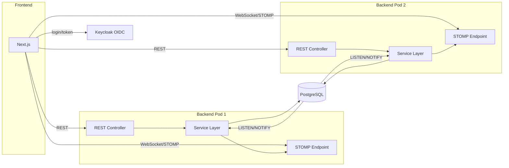

# TechSpec — Kanban Configurável
_Versão: 1.0 | Status: Draft | Data: 2026-08-22 | Autor: Thiago Goncalves Cavalcante_
_PRD: docs/prd/kanban-configuravel-prd.md v1.1_

---

## 1. Visão Geral Técnica

Sistema web para gestão de atividades em board kanban com workflows e etapas configuráveis por projeto. Backend Spring Boot (Java 25) expõe API REST + WebSocket/STOMP para atualização em tempo real; frontend Next.js consome ambos. Autenticação via Keycloak (OIDC), com RBAC híbrido (papéis/permissões modelados na aplicação). Persistência em PostgreSQL, sem cache/broker dedicado nesta fase — broadcast entre pods via `LISTEN/NOTIFY`, e cálculo do dashboard assíncrono para evitar timeout.

**Sistemas afetados:** CRUDAO (único sistema; integração externa apenas com Keycloak).

**Abordagem:** REST + WebSocket/STOMP (event-driven para atualizações), processamento assíncrono para agregações pesadas (dashboard).

---

## 2. Decisões Arquiteturais

> Decisões: ADR-001, ADR-002, ADR-003, ADR-004, ADR-005

| ADR | Decisão | Impacto |
|-----|---------|---------|
| ADR-001 | Stack backend Java 25 + Spring Boot LTS, WebSocket/STOMP, OIDC client | Define linguagem, framework e mecanismo de tempo real |
| ADR-002 | PostgreSQL único armazenamento, sem cache/broker nesta fase | Simplicidade inicial; risco de escala registrado |
| ADR-003 | RBAC híbrido: Keycloak autentica, aplicação modela papéis/permissões | Necessário para RF-013 (papéis configuráveis em runtime) |
| ADR-004 | Broadcast entre pods via PostgreSQL LISTEN/NOTIFY | Resolve consistência multi-pod sem broker dedicado (RNF-002) |
| ADR-005 | Dashboard calculado de forma assíncrona (`@Async` + entrega via WebSocket) | Evita timeout HTTP em agregações sobre período longo (RF-007) |

---

## 3. Modelo de Dados

→ Documento completo: [data-model.md](kanban-configuravel/data-model.md)

**Entidades principais:**

| Entidade | Atributos-chave | Relacionamentos |
|----------|----------------|----------------|
| Projeto | nome, workflow_ativo_id | 1:N Workflow, 1:N Tarefa, 1:N Raia (opcional) |
| Workflow | projeto_id, versao | 1:N Etapa; 1:N Tarefa (via herança do projeto) |
| Etapa | workflow_id, ordem, e_final | 1:N Transição (origem/destino), 1:N Tarefa |
| Transição | etapa_origem_id, etapa_destino_id, tipo | N:1 Etapa (origem e destino) |
| Raia | projeto_id (nullable), ordem | N:1 Projeto (opcional); 1:N Tarefa |
| Tarefa | projeto_id, workflow_id, etapa_atual_id, impedida, tipo | N:1 Projeto/Workflow/Etapa/Raia, 1:N RegistroEtapa, 1:N Impedimento, 1:N Observador |
| RegistroEtapa | tarefa_id, etapa_id, entrada_em, saida_em, tempo_impedimento_segundos | N:1 Tarefa, N:1 Etapa |
| Impedimento | tarefa_id, registro_etapa_id, inicio_em, fim_em | N:1 Tarefa, N:1 RegistroEtapa |
| Observador | tarefa_id, usuario_id | N:1 Tarefa, N:1 Usuário |
| Usuário | keycloak_sub, papel_id | N:1 Papel |
| Papel | nome, protegido | 1:N PapelPermissao |
| Permissão | chave | 1:N PapelPermissao |

---

## 4. Contratos de API / Interface

### Board — REST

**Tipo:** REST

**Contrato:**
- Entrada: `GET /api/projetos/{id}/board` (query: nenhum obrigatório)
- Saída: colunas (etapas), raias, tarefas posicionadas, transições permitidas por etapa atual
- Erros: 403 (sem permissão de visualizar o projeto), 404 (projeto não encontrado)

### Mover tarefa — REST

**Tipo:** REST

**Contrato:**
- Entrada: `PATCH /api/tarefas/{id}/mover` `{ etapaDestinoId }`
- Saída: tarefa atualizada com nova etapa e novo RegistroEtapa aberto
- Erros: 409 (transição não permitida pelo workflow), 403 (sem permissão)

### Marcar/desmarcar impedimento — REST

**Tipo:** REST

**Contrato:**
- Entrada: `POST /api/tarefas/{id}/impedimento` `{ motivo? }` | `DELETE /api/tarefas/{id}/impedimento`
- Saída: tarefa com `impedida=true/false`, impedimento aberto/fechado
- Erros: 403, 404

### Eventos em tempo real — WebSocket/STOMP

**Tipo:** Event

**Contrato:**
- Canal: `/topic/projetos/{id}/board`
- Payload: `{ tipo: "TAREFA_MOVIDA" | "IMPEDIMENTO_ALTERADO" | "TAREFA_CRIADA" | ..., tarefaId, ... }`
- Entrega: em até 2s após o evento de origem (RNF-001)

### Dashboard assíncrono — REST + Event

**Tipo:** REST (disparo) + Event (entrega)

**Contrato:**
- Entrada: `POST /api/projetos/{id}/dashboard/calcular` `{ dataInicio, dataFim }`
- Saída imediata: `{ jobId }` (202 Accepted)
- Entrega do resultado: evento STOMP `/topic/projetos/{id}/dashboard/{jobId}` com `{ leadTimeMedioPorEtapa, tempoMedioImpedimento }`
- Fallback: `GET /api/projetos/{id}/dashboard/jobs/{jobId}` para polling se WebSocket indisponível

### Autenticação — OIDC (Keycloak)

→ Contrato mock: [CRUDAO-keycloak-mock-contract.md](../contracts/CRUDAO-keycloak-mock-contract.md) — **PENDENTE DE VALIDAÇÃO**, sem instância real disponível ainda.

---

## 5. Arquitetura e Fluxo

**Fluxo principal (mover tarefa):**
1. Frontend envia `PATCH /api/tarefas/{id}/mover` ao pod que o atende.
2. Service valida transição contra o workflow (RN-003), grava novo `RegistroEtapa` e fecha o anterior no PostgreSQL.
3. Service dispara `NOTIFY` no canal do projeto com o evento.
4. Todos os pods inscritos (`LISTEN`) recebem a notificação e retransmitem via STOMP aos clientes conectados localmente, incluindo observadores da tarefa (RF-005).
5. Frontend atualiza o board em até 2s (RNF-001).

---

## 6. Dependências Inter-Sistemas

| Sistema | Interface | Status | Mock? |
|---------|-----------|--------|-------|
| Keycloak | Autenticação OIDC | ok — validado na TASK-00.1 | Não — [CRUDAO-keycloak-contract.md](../contracts/CRUDAO-keycloak-contract.md) |

**Task de substituição:** concluída — TASK-00.1 provisionou Keycloak via Docker, configurou realm/client do CRUDAO e validou as claims (2026-08-22).

---

## 7. Estratégia de Testes

| Tipo | Ferramenta | Cobertura alvo |
|------|-----------|----------------|
| Unitário (regras de negócio) | JUnit 5 | 80% (TDD) / 100% para cenários Gherkin do PRD (BDD) |
| Integração (API + PostgreSQL) | JUnit 5 + Testcontainers | Fluxos críticos: transições de workflow, cálculo de lead-time, RBAC |
| Frontend (componentes) | Jest/Vitest + Testing Library | 80% (TDD) / 100% para cenários Gherkin do PRD (BDD) |
| E2E | A definir em `/tasks` (ex.: Playwright) | Fluxos principais: mover card, marcar impedimento, dashboard |

Cenários prioritários de teste: engine de transições de workflow (permitido/proibido), cálculo de lead-time com períodos de impedimento intercalados, RBAC (papel admin protegido — RN-006), broadcast multi-pod (LISTEN/NOTIFY).

---

## 8. Segurança e Observabilidade

**Segurança:**
- Toda rota de escrita valida permissão do usuário autenticado via papel/permissão (RNF-003).
- Papel `admin` protegido contra alteração por papéis delegados (RN-006), validado no Service, não apenas na UI.
- Fallback de autenticação própria caso Keycloak esteja indisponível (RF-014 Should Have) — detalhar mecanismo na implementação.
- Boas práticas OWASP Top 10 como baseline (validação de entrada via Bean Validation, prepared statements via JPA).

**Observabilidade:**
- Logs: arquivo local com rotação a cada 5MB, retendo os 10 mais recentes (conforme guidelines/observability.md).
- Métricas: nenhuma nesta fase (sem APM/tracing).

---

## 9. Matriz de Rastreabilidade

| RF/RNF | Implementado em | Validado por |
|--------|----------------|-------------|
| RF-001 | Board REST + componente de board no frontend | Teste de integração + E2E |
| RF-002 | Engine de transições (Service de Workflow/Transição) | Teste unitário de transições permitidas/proibidas |
| RF-003 | CRUD de Tarefa (Controller/Service/Repository) | Teste de integração |
| RF-004 | Endpoint de impedimento + indicador visual no card | Teste de integração + E2E |
| RF-005 | Listener LISTEN/NOTIFY + entrega STOMP a observadores | Teste de integração multi-pod |
| RF-006 | RegistroEtapa + Impedimento (cálculo de lead-time) | Teste unitário de cálculo |
| RF-007 | Dashboard assíncrono (`@Async` + STOMP/polling) | Teste de integração |
| RF-008 | CRUD de Projeto | Teste de integração |
| RF-009 | CRUD de Workflow | Teste de integração |
| RF-010 | CRUD de Etapa | Teste de integração |
| RF-011 | CRUD de Raia (projeto/default) | Teste de integração |
| RF-012 | Transição tipo REABERTURA | Teste unitário + E2E |
| RF-013 | Papel/Permissão/PapelPermissao + validação no Service | Teste unitário de RBAC |
| RF-014 | Client OIDC (Keycloak) — mock pendente | Teste manual pós-validação do contrato real |
| RNF-001 | Arquitetura STOMP + LISTEN/NOTIFY | Teste de carga (latência <2s) |
| RNF-002 | PostgreSQL como fonte única de verdade + LISTEN/NOTIFY | Teste multi-pod (2+ instâncias) |
| RNF-003 | Validação de permissão em todo endpoint de escrita | Teste unitário de RBAC |
| RNF-004 | Empacotamento Docker | Build e execução via docker-compose |
| RNF-005 | Frontend responsivo Next.js | Teste manual/E2E em resoluções desktop |

---

## 10. Questões em Aberto

| # | Questão | Responsável | Prazo |
|---|---------|------------|-------|
| Q-001 | Validar `LISTEN/NOTIFY` sob carga real (2+ pods, centenas de usuários) — decidir se migra para Redis Pub/Sub (ADR-002/ADR-004) | Thiago Goncalves Cavalcante | Após primeira entrega em ambiente com múltiplos pods |
| Q-002 | ~~Provisionar e validar instância real de Keycloak~~ — **resolvido na TASK-00.1** (2026-08-22). Nota: `realm_access.roles` está no `access_token`, não no `id_token` — ajustar leitura de papel na TASK-04.1 | Thiago Goncalves Cavalcante | Concluído |
| Q-003 | Definir granularidade final da lista de Permissões (chaves) | Thiago Goncalves Cavalcante | Durante `/tasks`/implementação |
| Q-004 | Definir valores do enum TipoTarefa | Thiago Goncalves Cavalcante | Durante `/tasks`/implementação |
| Q-005 | Escolher ferramenta de E2E (ex.: Playwright) | Thiago Goncalves Cavalcante | Durante `/tasks` |

---

## 11. Histórico de Revisões

| Versão | Data | Autor | Alteração |
|--------|------|-------|-----------|
| 1.0 | 2026-08-22 | Thiago Goncalves Cavalcante | Versão inicial |
