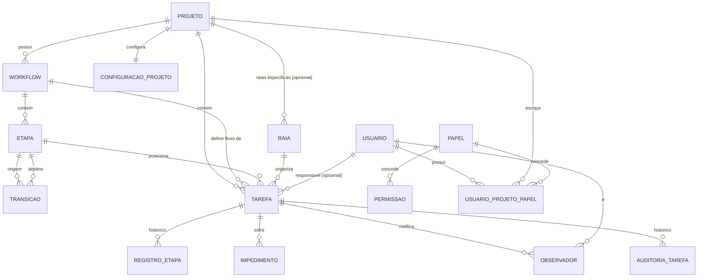

# Data Model — Kanban Configurável
_Versão: 1.2 | Data: 2026-08-23_
_PRD: docs/prd/kanban-configuravel-prd.md v1.2 | Ver: [BDR-001](../../decisions/BDR-001-rbac-por-projeto.md), [ADR-006](../../decisions/ADR-006-rbac-por-projeto-enforcement.md)_

---

## Diagrama (visão relacional simplificada)

**Nota de migração (v1.0 → v1.1, BDR-001):** `Usuario.papel_id` (vínculo único global) é substituído por `UsuarioProjetoPapel` como fonte principal de papéis escopados por projeto. O papel `admin` deixa de ser atribuído via `UsuarioProjetoPapel` — vira uma flag booleana (`admin`) em `Usuario`, já que é global e não tem `projetoId`. Papel `user` (legado) permanece como fallback sem `UsuarioProjetoPapel` nenhum (usuário sem associação a projeto = sem permissões em nenhum projeto).

---

## Entidades

### Projeto

| Campo | Tipo | Notas |
|---|---|---|
| id | UUID | PK |
| nome | string | obrigatório |
| descricao | string | opcional |
| workflow_ativo_id | UUID | FK Workflow — workflow atualmente em uso pelo projeto |
| data_finalizacao | timestamp (nullable) | preenchida = projeto somente leitura (RN-015, RF-008) |
| criado_em / atualizado_em | timestamp | auditoria mínima |

**Regra:** exclusão bloqueada se houver tarefas ativas (RN-005). Com `data_finalizacao` preenchida, toda escrita no projeto (tarefas, workflow, etapas, raias, associações de membro) é bloqueada (403), inclusive para `admin`/`project_admin` — só `AutorizacaoProjetoService` com a permissão `projeto:gerenciar` pode reabrir (limpar `data_finalizacao`).

### Workflow

| Campo | Tipo | Notas |
|---|---|---|
| id | UUID | PK |
| projeto_id | UUID | FK Projeto |
| nome | string | obrigatório |
| versao | int | incrementada a cada edição relevante (rastreabilidade de mudanças de fluxo) |

**Regra:** editável; edição afeta todas as tarefas do projeto (confirmado na entrevista).

### Etapa (Coluna)

| Campo | Tipo | Notas |
|---|---|---|
| id | UUID | PK |
| workflow_id | UUID | FK Workflow |
| nome | string | obrigatório |
| ordem | int | posição no board |
| etapa_final | boolean | true = etapa terminal, sem transição de saída padrão (RN-004). Nomeado `etapaFinal` (não `eFinal`) na implementação — `eFinal` colide com a convenção JavaBeans de introspecção (`isEFinal()` resolve para a propriedade `EFinal`, não `eFinal`), quebrando serialização/mapeamento silenciosamente (achado na TASK-01.1). |

**Regra:** exclusão bloqueada se houver tarefas na etapa (RN-005). Toda etapa não-final deve ter ao menos uma transição de saída configurada (RN-003).

### Transição

| Campo | Tipo | Notas |
|---|---|---|
| id | UUID | PK |
| etapa_origem_id | UUID | FK Etapa |
| etapa_destino_id | UUID | FK Etapa |
| tipo | enum | `NORMAL`, `REABERTURA` (usada para "desfinalizar", RF-012) |

### Raia (Swimlane)

| Campo | Tipo | Notas |
|---|---|---|
| id | UUID | PK |
| projeto_id | UUID (nullable) | FK Projeto — nulo = raia default global |
| nome | string | obrigatório |
| ordem | int | posição vertical no board |

**Regra:** projeto sem raias próprias usa as raias default globais, que podem ser mantidas/editadas/removidas pelo admin do projeto (clarificado).

### Tarefa

| Campo | Tipo | Notas |
|---|---|---|
| id | UUID | PK |
| projeto_id | UUID | FK Projeto |
| workflow_id | UUID | FK Workflow (herdado do projeto no momento) |
| etapa_atual_id | UUID | FK Etapa |
| raia_id | UUID (nullable) | FK Raia |
| tipo | enum (TipoTarefa) | avaliar valores durante implementação (ex.: FEATURE, BUG, CHORE) |
| titulo | string | obrigatório |
| descricao | text | opcional |
| responsavel_id | UUID (nullable) | FK Usuário |
| impedida | boolean | estado atual de impedimento |
| criado_em / atualizado_em | timestamp | — |

**Regra:** tarefa pode ser movida entre projetos por um admin com permissão em ambos os projetos (confirmado na entrevista) — operação registra novo `projeto_id`/`workflow_id`.

### RegistroEtapa (histórico de lead-time)

| Campo | Tipo | Notas |
|---|---|---|
| id | UUID | PK |
| tarefa_id | UUID | FK Tarefa |
| etapa_id | UUID | FK Etapa |
| entrada_em | timestamp | — |
| saida_em | timestamp (nullable) | nulo = etapa atual em andamento |
| tempo_impedimento_segundos | bigint | soma do tempo impedido durante esta permanência na etapa (RN-002) |

### Impedimento

| Campo | Tipo | Notas |
|---|---|---|
| id | UUID | PK |
| tarefa_id | UUID | FK Tarefa |
| registro_etapa_id | UUID | FK RegistroEtapa — vincula o impedimento à permanência na etapa |
| inicio_em | timestamp | — |
| fim_em | timestamp (nullable) | nulo = impedimento ativo |
| motivo | string | opcional |

### Observador

| Campo | Tipo | Notas |
|---|---|---|
| tarefa_id | UUID | FK Tarefa |
| usuario_id | UUID | FK Usuário |

Chave composta (tarefa_id, usuario_id). Apenas usuários cadastrados podem ser observadores (RN-007).

### Usuário

| Campo | Tipo | Notas |
|---|---|---|
| id | UUID | PK |
| keycloak_sub | string (nullable) | claim `sub` do Keycloak, quando SSO habilitado |
| nome / email | string | — |
| admin | boolean | true = papel global `admin` (BDR-001) — acesso total, sem depender de `UsuarioProjetoPapel`. Default `false` |

**Nota de migração (Q-006 resolvida — achado do comitê, database):** `papel_id` (v1.0, hoje `@ManyToOne(optional = false)` em `Usuario.java`) é removido em duas migrations separadas — (1) script de dados, idempotente, com log de auditoria das linhas geradas; (2) só depois, migration de schema dropando a coluna. Mapeamento do script de dados:
- `papel.nome = 'admin'` → `Usuario.admin = true`, sem linha em `UsuarioProjetoPapel`.
- `papel.nome = 'user'` (ou qualquer outro) → **nenhuma linha gerada em `UsuarioProjetoPapel`** — usuários com papéis que hoje concediam acesso global (`project_admin`, `product_owner`, `dev`, `gestor`, caso já existam em dados de dev/homolog) perdem esse acesso até serem reassociados manualmente a projeto(s) específicos via RF-015. Decisão deliberada: como não existe hoje o conceito de "projeto ao qual o papel se aplicava" (o vínculo era global), extrapolar automaticamente para "todos os projetos existentes" concederia permissão nunca de fato aprovada por projeto — mais seguro exigir reatribuição explícita do que herdar escopo implícito. Sem impacto em produção (ambiente ainda em dev/homolog).

Usuários autoprovisionados sem nenhuma role do Keycloak mapeada para um papel configurado continuam sem nenhuma associação (equivalente ao antigo papel `user`, RN-014): sem `admin=true` e sem linhas em `UsuarioProjetoPapel`, o usuário não tem permissão em nenhum projeto até ser associado (RF-015).

### Papel

| Campo | Tipo | Notas |
|---|---|---|
| id | UUID | PK |
| nome | string | catálogo global: `admin`, `project_admin`, `product_owner`, `dev`, `gestor`, `user` (legado) — mais os que o admin global criar (RF-013) |
| protegido | boolean | true apenas para `admin` — impede edição/exclusão por papéis delegados (RN-006) |

**Regra:** `admin` nunca aparece em `UsuarioProjetoPapel` — é concedido via `Usuario.admin`. Os demais papéis do catálogo (incluindo customizados criados pelo admin) são atribuíveis por projeto via `UsuarioProjetoPapel`.

### Permissão

| Campo | Tipo | Notas |
|---|---|---|
| id | UUID | PK |
| chave | string | `projeto:gerenciar`, `workflow:gerenciar`, `tarefa:gerenciar`, `tarefa:atribuir` (atribuir a outro usuário — RN-012), `tarefa:finalizar` (RN-011, RF-012), `impedimento:marcar`, `dashboard:visualizar` — atribuíveis via `UsuarioProjetoPapel` (escopadas a projeto). `papel:gerenciar` continua existindo no catálogo, mas **nunca é atribuível via `UsuarioProjetoPapel`** (achado do comitê de análise — security, revisão v1.2): checada exclusivamente contra `Usuario.admin` em `PapelController`, nunca contra papel de projeto — fecha o vetor de escalação em que um `project_admin` manipularia permissões de um papel existente (RN-006 superseded em parte, PRD v1.3) |

### PapelPermissao

| Campo | Tipo | Notas |
|---|---|---|
| papel_id | UUID | FK Papel |
| permissao_id | UUID | FK Permissão |

Chave composta (papel_id, permissao_id).

### UsuarioProjetoPapel

| Campo | Tipo | Notas |
|---|---|---|
| usuario_id | UUID | FK Usuário |
| projeto_id | UUID | FK Projeto |
| papel_id | UUID | FK Papel — **nunca** aponta para o papel `admin`, e (achado do comitê — security) o papel referenciado nunca pode conter a permissão `papel:gerenciar` |

**Chave primária composta, na ordem `(usuario_id, projeto_id, papel_id)`** (achado do comitê — database: a ordem importa para qual consulta ganha índice de graça) — cobre com prefixo a checagem pontual de `AutorizacaoProjetoService` (`usuario_id + projeto_id`). Permite múltiplos papéis do mesmo usuário no mesmo projeto (BDR-001, RN-008). Permissões efetivas do usuário naquele projeto = união das permissões de todos os papéis atribuídos ali.

**Índice adicional `idx_upp_projeto (projeto_id)`** (achado do comitê — database): necessário para `GET /api/projetos/{projetoId}/membros` (lista todos os membros de um projeto, filtrando só por `projeto_id` — não é prefixo da PK) — sem ele, a consulta faz scan completo conforme a tabela cresce.

Gerenciado via RF-015, por `admin` global (qualquer projeto) ou `project_admin` (só o(s) seu(s) projeto(s), e só atribuindo papéis já existentes no catálogo — não cria papel novo).

### ConfiguracaoProjeto

| Campo | Tipo | Notas |
|---|---|---|
| projeto_id | UUID | PK/FK Projeto (1:1) |
| dev_pode_excluir_tarefa | boolean | default `false` (RN-009) |
| dev_pode_editar_tarefa_iniciada | boolean | default `false` — quando `true`, ignora a trava de "tarefa iniciada" (RN-009, RN-010) para `dev` |
| gestor_ve_board | boolean | default `false` — quando `true`, `gestor` ganha acesso de leitura ao board do projeto, além do dashboard (RF-013, RN-013) |

Criada com os defaults no momento da criação do Projeto (RF-016). Conjunto fechado de toggles — não é RBAC granular customizável (decisão registrada em BDR-001, alternativa descartada).

### AuditoriaTarefa

| Campo | Tipo | Notas |
|---|---|---|
| id | UUID | PK |
| tarefa_id | UUID | FK Tarefa |
| usuario_id | UUID | FK Usuário — autor da alteração |
| campo | enum | `RESPONSAVEL`, `TITULO`, `DESCRICAO`, `ETAPA` (RF-017, RN-016) |
| valor_anterior | text (nullable) | representação textual do valor antes (ex.: nome do usuário anterior, nome da etapa anterior) |
| valor_novo | text (nullable) | representação textual do valor depois |
| criado_em | timestamp | — |

**Regra:** gravado no mesmo Service que executa a alteração (troca de responsável, edição de título/descrição, movimentação de etapa), na mesma transação — nunca em processo assíncrono separado, para não perder registro em caso de falha parcial. Somente leitura via API (RF-017) — sem endpoint de escrita direta.

**Índice `idx_auditoria_tarefa (tarefa_id, criado_em)`** (achado do comitê — database): a única leitura prevista é "histórico de uma tarefa ordenado no tempo" (`GET /api/tarefas/{id}/historico`), então o índice composto cobre a consulta inteira sem sort adicional.

**Retenção (Q-008, questão em aberto — achado do comitê — database):** a tabela cresce sem TTL/purge/particionamento definido; PRD não define RNF de retenção. Não bloqueia `/tasks` (volume atual não é crítico), mas deve ser resolvido antes de produção.

---

## Observações de escala

Toda leitura de estado (etapa atual, impedimento, lead-time) deve vir do PostgreSQL como fonte única da verdade — nenhum estado de aplicação deve viver apenas em memória de um pod, para suportar múltiplas instâncias sem inconsistência (RNF-002, ADR-002, ADR-004).

## Autorização (ADR-006)

`AutorizacaoProjetoService.exigirPermissao(usuario, projetoId, permissao)`: (1) consulta `Usuario.admin` primeiro — se `true`, autorizado sem mais consultas; (2) se o projeto tem `data_finalizacao` preenchida e a operação é de escrita, bloqueia (RN-015) — checagem única, não replicada por Service; (3) agrega as permissões de todas as linhas de `UsuarioProjetoPapel` do usuário naquele `projeto_id` (índice `idx_upp_projeto`) e verifica se a chave exigida está no conjunto. `projetoId` é sempre resolvido no backend a partir da entidade carregada pelo Service (nunca aceito cru do payload do cliente) — RNF-003 reforçada no PRD v1.2. `papel:gerenciar` não passa por este serviço — é checado à parte, contra `Usuario.admin` diretamente, em `PapelController` (nunca via papel de projeto).

**Enforcement estrutural (achado convergente do comitê — security + architect):** além do teste de integração por endpoint, um teste estrutural no CI verifica que todo método público de `@Service` de domínio que grava entidade com `projetoId` contém, na cadeia de chamadas, uma invocação a `exigirPermissao` — reduz o risco de esquecimento silencioso ao trocar o AOP genérico por chamada explícita (ver ADR-006, seção Negativas).
