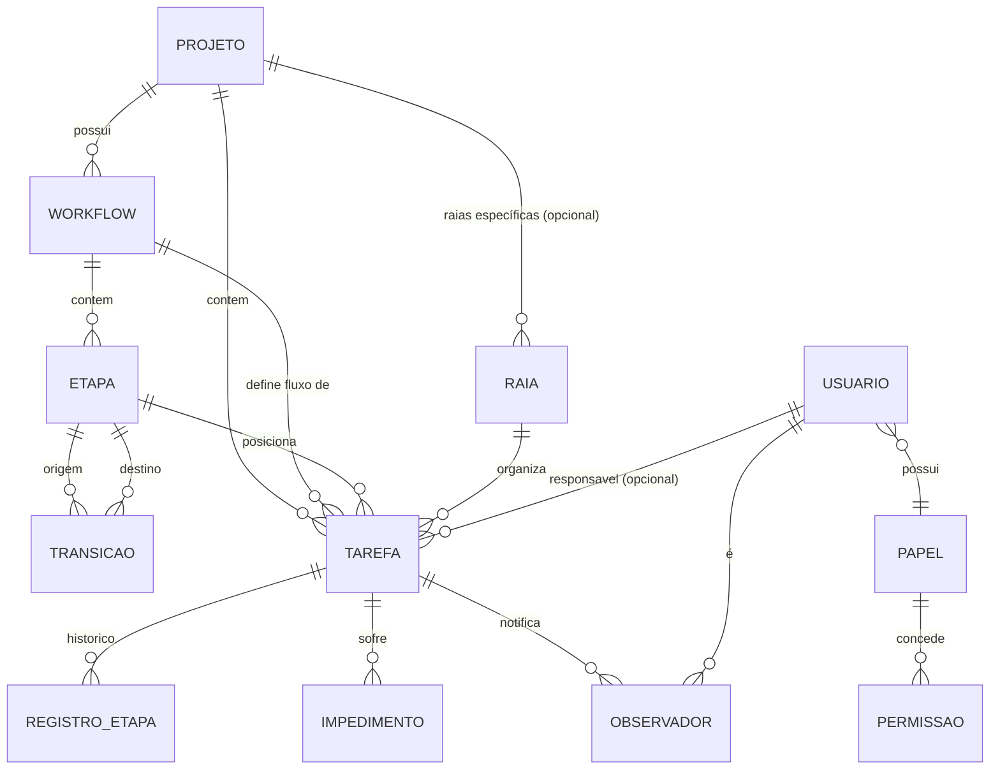

# Data Model — Kanban Configurável
_Versão: 1.0 | Data: 2026-08-22_

---

## Diagrama (visão relacional simplificada)

---

## Entidades

### Projeto

| Campo | Tipo | Notas |
|---|---|---|
| id | UUID | PK |
| nome | string | obrigatório |
| descricao | string | opcional |
| workflow_ativo_id | UUID | FK Workflow — workflow atualmente em uso pelo projeto |
| criado_em / atualizado_em | timestamp | auditoria mínima |

**Regra:** exclusão bloqueada se houver tarefas ativas (RN-005).

### Workflow

| Campo | Tipo | Notas |
|---|---|---|
| id | UUID | PK |
| projeto_id | UUID | FK Projeto |
| nome | string | obrigatório |
| versao | int | incrementada a cada edição relevante (rastreabilidade de mudanças de fluxo) |

**Regra:** editável; edição afeta todas as tarefas do projeto (confirmado na entrevista).

### Etapa (Coluna)

| Campo | Tipo | Notas |
|---|---|---|
| id | UUID | PK |
| workflow_id | UUID | FK Workflow |
| nome | string | obrigatório |
| ordem | int | posição no board |
| etapa_final | boolean | true = etapa terminal, sem transição de saída padrão (RN-004). Nomeado `etapaFinal` (não `eFinal`) na implementação — `eFinal` colide com a convenção JavaBeans de introspecção (`isEFinal()` resolve para a propriedade `EFinal`, não `eFinal`), quebrando serialização/mapeamento silenciosamente (achado na TASK-01.1). |

**Regra:** exclusão bloqueada se houver tarefas na etapa (RN-005). Toda etapa não-final deve ter ao menos uma transição de saída configurada (RN-003).

### Transição

| Campo | Tipo | Notas |
|---|---|---|
| id | UUID | PK |
| etapa_origem_id | UUID | FK Etapa |
| etapa_destino_id | UUID | FK Etapa |
| tipo | enum | `NORMAL`, `REABERTURA` (usada para "desfinalizar", RF-012) |

### Raia (Swimlane)

| Campo | Tipo | Notas |
|---|---|---|
| id | UUID | PK |
| projeto_id | UUID (nullable) | FK Projeto — nulo = raia default global |
| nome | string | obrigatório |
| ordem | int | posição vertical no board |

**Regra:** projeto sem raias próprias usa as raias default globais, que podem ser mantidas/editadas/removidas pelo admin do projeto (clarificado).

### Tarefa

| Campo | Tipo | Notas |
|---|---|---|
| id | UUID | PK |
| projeto_id | UUID | FK Projeto |
| workflow_id | UUID | FK Workflow (herdado do projeto no momento) |
| etapa_atual_id | UUID | FK Etapa |
| raia_id | UUID (nullable) | FK Raia |
| tipo | enum (TipoTarefa) | avaliar valores durante implementação (ex.: FEATURE, BUG, CHORE) |
| titulo | string | obrigatório |
| descricao | text | opcional |
| responsavel_id | UUID (nullable) | FK Usuário |
| impedida | boolean | estado atual de impedimento |
| criado_em / atualizado_em | timestamp | — |

**Regra:** tarefa pode ser movida entre projetos por um admin com permissão em ambos os projetos (confirmado na entrevista) — operação registra novo `projeto_id`/`workflow_id`.

### RegistroEtapa (histórico de lead-time)

| Campo | Tipo | Notas |
|---|---|---|
| id | UUID | PK |
| tarefa_id | UUID | FK Tarefa |
| etapa_id | UUID | FK Etapa |
| entrada_em | timestamp | — |
| saida_em | timestamp (nullable) | nulo = etapa atual em andamento |
| tempo_impedimento_segundos | bigint | soma do tempo impedido durante esta permanência na etapa (RN-002) |

### Impedimento

| Campo | Tipo | Notas |
|---|---|---|
| id | UUID | PK |
| tarefa_id | UUID | FK Tarefa |
| registro_etapa_id | UUID | FK RegistroEtapa — vincula o impedimento à permanência na etapa |
| inicio_em | timestamp | — |
| fim_em | timestamp (nullable) | nulo = impedimento ativo |
| motivo | string | opcional |

### Observador

| Campo | Tipo | Notas |
|---|---|---|
| tarefa_id | UUID | FK Tarefa |
| usuario_id | UUID | FK Usuário |

Chave composta (tarefa_id, usuario_id). Apenas usuários cadastrados podem ser observadores (RN-007).

### Usuário

| Campo | Tipo | Notas |
|---|---|---|
| id | UUID | PK |
| keycloak_sub | string (nullable) | claim `sub` do Keycloak, quando SSO habilitado |
| nome / email | string | — |
| papel_id | UUID | FK Papel |

### Papel

| Campo | Tipo | Notas |
|---|---|---|
| id | UUID | PK |
| nome | string | ex.: admin, user, dev, gestor (configurável) |
| protegido | boolean | true apenas para `admin` — impede edição/exclusão por papéis delegados (RN-006) |

### Permissão

| Campo | Tipo | Notas |
|---|---|---|
| id | UUID | PK |
| chave | string | ex.: `projeto:gerenciar`, `workflow:gerenciar`, `tarefa:gerenciar`, `impedimento:marcar`, `papel:gerenciar`, `dashboard:visualizar` — granularidade final definida na implementação |

### PapelPermissao

| Campo | Tipo | Notas |
|---|---|---|
| papel_id | UUID | FK Papel |
| permissao_id | UUID | FK Permissão |

Chave composta (papel_id, permissao_id).

---

## Observações de escala

Toda leitura de estado (etapa atual, impedimento, lead-time) deve vir do PostgreSQL como fonte única da verdade — nenhum estado de aplicação deve viver apenas em memória de um pod, para suportar múltiplas instâncias sem inconsistência (RNF-002, ADR-002, ADR-004).
